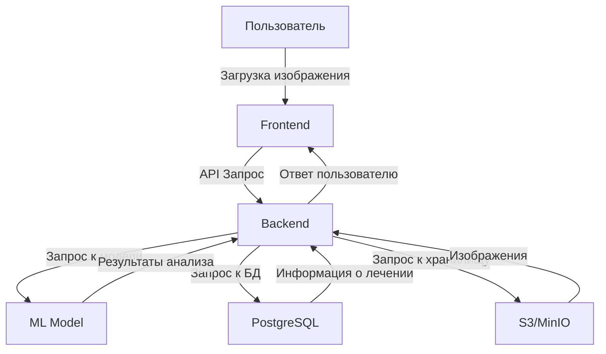
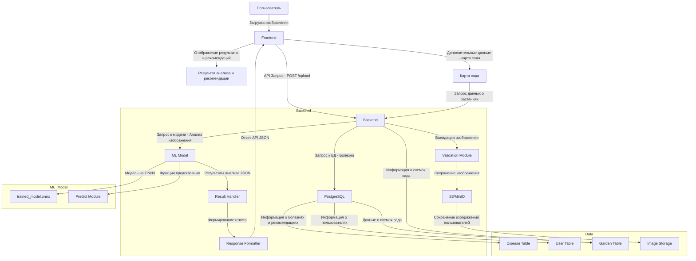

# Архитектура проекта

## Введение
Проект "Распознавание дефектов растений" представляет собой систему, которая анализирует изображения растений, определяет их заболевания и предоставляет рекомендации по лечению и уходу. Система состоит из нескольких компонентов, которые взаимодействуют друг с другом через API.

## Основные компоненты

1. **Клиентская часть (Frontend)**
   - Написана на React.js.
   - Позволяет пользователям загружать изображения растений, получать результаты анализа и управлять схемами огорода.

2. **Серверная часть (Backend)**
   - Написана на Python с использованием FastAPI.
   - Обрабатывает запросы от клиента, выполняет анализ изображений и предоставляет рекомендации.

3. **Модель машинного обучения (ML Model)**
   - Использует TensorFlow или PyTorch для распознавания дефектов растений.
   - Обучена на специализированных наборах данных.

4. **База данных**
   - Используется PostgreSQL для хранения информации о пользователях, результатах анализа и рекомендациях.

5. **Хранилище изображений**
   - AWS S3 или MinIO для хранения загруженных изображений.

## Диаграмма архитектуры

### Или детальнее

## Детали реализации

### Клиентская часть
- Загружает изображения с помощью формы.
- Отображает результаты анализа в удобном интерфейсе.
- Управляет схемой огорода с визуализацией.

### Серверная часть
- **Модули:**
  - Модуль обработки изображений.
  - Модуль рекомендаций.
  - Модуль управления схемой огорода.
- Использует FastAPI для маршрутизации.

### Модель машинного обучения
- Предобучена на данных с дефектами растений.
- Оптимизирована для быстрого выполнения на сервере.

### База данных
- Хранит данные о пользователях, результатах анализа, растениях и рекомендациях.
- Спроектирована для минимизации задержек.

### Хранилище изображений
- Обеспечивает безопасное и долговечное хранение загруженных изображений.
