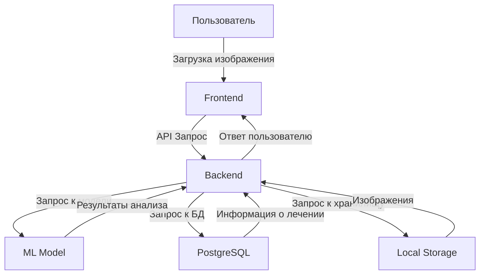
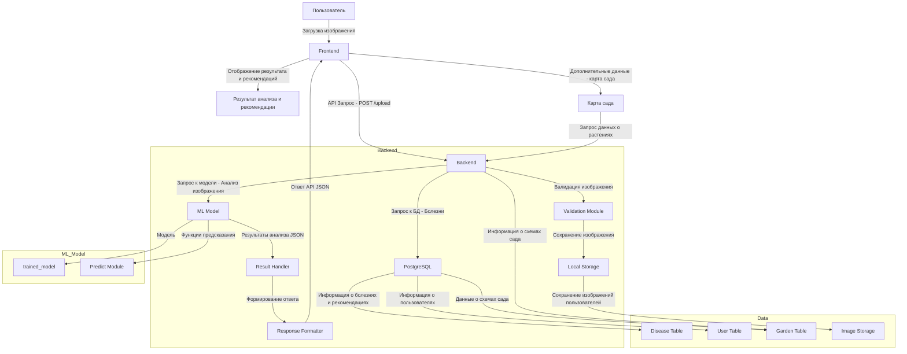

# Архитектура проекта

## Введение
Проект "Распознавание дефектов растений" представляет собой систему, которая анализирует изображения растений, определяет их заболевания и предоставляет рекомендации по лечению и уходу. Система состоит из нескольких компонентов, которые взаимодействуют друг с другом через API.

## Основные компоненты

1. **Клиентская часть (Frontend)**
   - Написана на React.js.
   - Позволяет пользователям загружать изображения растений, получать результаты анализа.

2. **Серверная часть (Backend)**
   - Написана на Python с использованием FastAPI.
   - Обрабатывает запросы от клиента, выполняет анализ изображений и предоставляет рекомендации.

3. **Модель машинного обучения (ML Model)**
   - Распознавание дефектов растений.
   - Обучена на специализированных наборах данных.

4. **База данных**
   - Используется PostgreSQL для хранения информации о пользователях, результатах анализа и рекомендациях.

5. **Хранилище изображений**
   - Локальное хранилище для сохранения загруженных изображений.

## Диаграмма архитектуры

### Или детальнее

## Детали реализации

### Клиентская часть
- Загружает изображения с помощью формы.
- Отображает результаты анализа в удобном интерфейсе.
- Управляет схемой огорода с визуализацией.

### Серверная часть
- **Модули:**
  - Модуль обработки изображений.
  - Модуль рекомендаций.
  - Модуль управления схемой огорода.
- Использует FastAPI для маршрутизации.

### Модель машинного обучения
- Предобучена на данных с дефектами растений.
- Оптимизирована для быстрого выполнения на сервере.

### База данных
- Хранит данные о пользователях, результатах анализа, растениях и рекомендациях.
- Спроектирована для минимизации задержек.

### Хранилище изображений
- Обеспечивает безопасное и долговечное хранение загруженных изображений.

## Этапы работы

### Backend
1. **Настройка FastAPI**
   - **Ответственный**: Ломакин Даниил
   - **Статус**: Выполнено
   - **Дедлайн**: 2025-01-15
   - **Описание**: Создание структуры проекта, настройка основных маршрутов.
   - **Артефакт**: [main.py](../backend/main.py)

2. **Подключение базы данных PostgreSQL**
   - **Ответственный**: Мустафаев Алим
   - **Статус**: Выполнено
   - **Дедлайн**: 2025-01-22
   - **Описание**: Настроены таблицы пользователей, болезней и результатов анализа.
   - **Артефакт**: [models.py](../backend/app/repository/models.py)

3. **Реализация авторизации и регистрации**
   - **Ответственный**: Ломакин Даниил
   - **Статус**: Выполнено
   - **Дедлайн**: 2025-02-05
   - **Описание**: Внедрена JWT-аутентификация, реализован контроль пользователей.
   - **Артефакт**: [authentication.py](../backend/app/routes/authentication.py)

4. **Реализация API для загрузки изображений**
   - **Ответственный**: Мустафаев Алим
   - **Статус**: Выполнено
   - **Дедлайн**: 2025-02-18
   - **Описание**: Настроена загрузка изображений, проверка формата и размеров.
   - **Артефакт**: [image_analysis.py](../backend/app/routes/image_analysis.py)

5. **Реализация API для анализа изображений**
   - **Ответственный**: Ломакин Даниил
   - **Статус**: В процессе
   - **Дедлайн**: 2025-03-25
   - **Описание**: Настройка обработки изображений с передачей в ML-модель.
   - **Артефакт**: [image_analysis.py](../backend/app/routes/image_analysis.py)

6. **Интеграция API с ML-моделью**
   - **Ответственный**: Мустафаев Алим
   - **Статус**: В процессе
   - **Дедлайн**: 2025-04-01
   - **Описание**: Настройка вызовов модели и получения предсказаний.
   - **Артефакт**: [predict.py](../ml_model/inference/predict.py)

7. **Документирование API (Swagger)**
   - **Ответственный**: Ломакин Даниил
   - **Статус**: Ожидание
   - **Дедлайн**: 2025-04-05
   - **Описание**: Добавление документации для всех маршрутов API.
   - **Артефакт**: [api_specification.md](../docs/api_specification.md)

### Frontend
1. **Разработка базовой структуры UI**
   - **Ответственный**: Хныченко Артём
   - **Статус**: Выполнено
   - **Дедлайн**: 2025-02-10
   - **Описание**: Создан каркас React-приложения.
   - **Артефакт**: [App.jsx](../frontend/src/App.jsx)

2. **Разработка интерфейса загрузки изображений**
   - **Ответственный**: Хныченко Артём
   - **Статус**: Выполнено
   - **Дедлайн**: 2025-02-20
   - **Описание**: Добавлена форма загрузки изображений с валидацией.
   - **Артефакт**: [FormFileInput.jsx](../frontend/src/components/FormFileInput/FormFileInput.jsx)

3. **Связь UI с backend**
   - **Ответственный**: Хныченко Артём
   - **Статус**: В процессе
   - **Дедлайн**: 2025-03-30
   - **Описание**: Настройка API-запросов и интеграция с backend.
   - **Артефакт**: [axiosInstance.js](../frontend/src/services/axiosInstance.js)

4. **Отображение результатов анализа**
   - **Ответственный**: Хныченко Артём
   - **Статус**: В процессе
   - **Дедлайн**: 2025-04-07
   - **Описание**: Добавление компонентов для визуализации предсказаний.
   - **Артефакт**: [DetectDisease.jsx](../frontend/src/pages/DetectDisease/DetectDisease.jsx)

5. **Добавление уведомлений об ошибках**
   - **Ответственный**: Хныченко Артём
   - **Статус**: Ожидание
   - **Дедлайн**: 2025-04-02
   - **Описание**: Добавление обработки ошибок API и уведомлений пользователям.
   - **Артефакт**: [ToastContainer](../frontend/src/App.jsx)

### QA
1. **Разработка плана тестирования**
   - **Ответственный**: Мазепа Илья
   - **Статус**: Выполнено
   - **Дедлайн**: 2025-02-25
   - **Описание**: Определены тест-кейсы для API, фронтенда и интеграции.
   - **Артефакт**: [Test Plan](../docs/test_plan.md)

2. **Написание API-тестов (Postman, PyTest)**
   - **Ответственный**: Мазепа Илья
   - **Статус**: В процессе
   - **Дедлайн**: 2025-04-01
   - **Описание**: Разработка тестов для API анализа изображений.
   - **Артефакт**: [API Tests](../tests/api_tests.py)

3. **Тестирование UX/UI**
   - **Ответственный**: Мазепа Илья
   - **Статус**: Ожидание
   - **Дедлайн**: 2025-04-05
   - **Описание**: Проверка удобства использования и интерфейса.
   - **Артефакт**: [UX/UI Report](../docs/ux_ui_report.md)

### ML
1. **Анализ датасета**
   - **Ответственный**: Амиров Гайсар
   - **Статус**: Выполнено
   - **Дедлайн**: 2025-01-30
   - **Описание**: Выбор датасета и предобработка данных.
   - **Артефакт**: [Dataset Analysis](../ml_model/train/dataset_analysis.md)

2. **Обучение модели до целевых метрик**
   - **Ответственный**: Амиров Гайсар
   - **Статус**: В процессе
   - **Дедлайн**: 2025-03-28
   - **Описание**: Настройка гиперпараметров и обучение модели.
   - **Артефакт**: [train.py](../ml_model/train/train.py)

3. **Интеграция модели с backend**
   - **Ответственный**: Шестаков Константин
   - **Статус**: Ожидание
   - **Дедлайн**: 2025-04-08
   - **Описание**: Настройка взаимодействия модели с API.
   - **Артефакт**: [predict.py](../ml_model/inference/predict.py)

### DevOps
1. **Настройка Docker-контейнеров**
   - **Ответственный**: Венков Кирилл
   - **Статус**: Выполнено
   - **Дедлайн**: 2025-02-12
   - **Описание**: Созданы Docker-контейнеры для backend, frontend и базы данных.
   - **Артефакт**: [docker-compose.yml](../docker/docker-compose.yml)

2. **Настройка CI/CD для backend и frontend**
   - **Ответственный**: Венков Кирилл
   - **Статус**: В процессе
   - **Дедлайн**: 2025-04-01
   - **Описание**: Настройка автоматического деплоя на сервер.
   - **Артефакт**: [CI/CD Pipeline](../.github/workflows/ci_cd.yml)

3. **Мониторинг API и модели (Prometheus, Grafana)**
   - **Ответственный**: Венков Кирилл
   - **Статус**: Ожидание
   - **Дедлайн**: 2025-04-10
   - **Описание**: Настройка логирования и мониторинга системы.
   - **Артефакт**: [Monitoring Setup](../docs/monitoring_setup.md)

### Tech Writing
1. **Создание руководства по API**
   - **Ответственный**: Ляшко Зоя
   - **Статус**: Выполнено
   - **Дедлайн**: 2025-03-01
   - **Описание**: Документированы базовые маршруты API.
   - **Артефакт**: [api_specification.md](../docs/api_specification.md)

2. **Подготовка гайда для пользователей**
   - **Ответственный**: Ляшко Зоя
   - **Статус**: Ожидание
   - **Дедлайн**: 2025-04-15
   - **Описание**: Создание пользовательской документации.
   - **Артефакт**: [User Guide](../docs/user_guide.md)

### Teamlead
1. **Организация процесса разработки**
   - **Ответственный**: Хныченко Артём
   - **Статус**: Выполнено
   - **Дедлайн**: 2025-01-05
   - **Описание**: Сформирован план работ, назначены ответственные.
   - **Артефакт**: [Project Plan](../docs/project_plan.md)

2. **Настройка системы управления задачами**
   - **Ответственный**: Хныченко Артём
   - **Статус**: Выполнено
   - **Дедлайн**: 2025-01-10
   - **Описание**: Создана доска задач в Notion, распределены приоритеты.
   - **Артефакт**: [Notion Board](../docs/notion_board.md)
